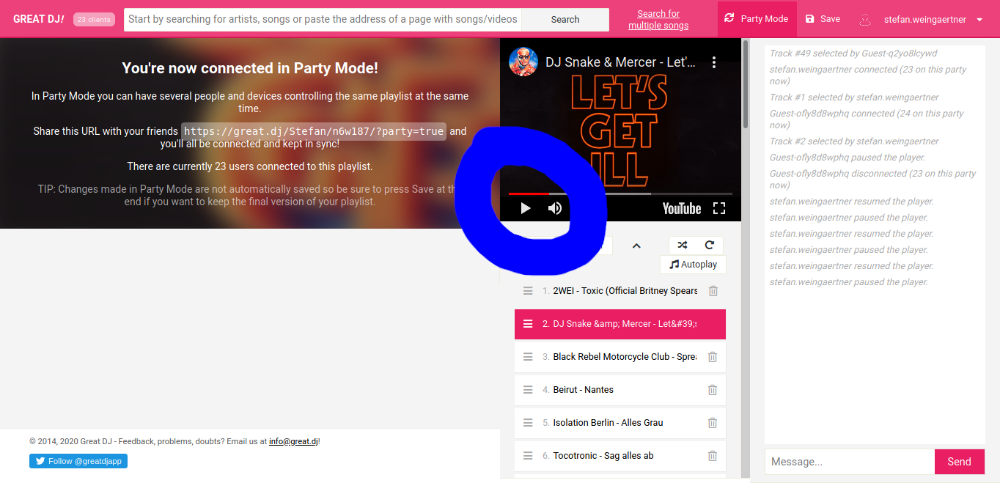

# partyyy
A GitHub repo for my birthday party

# Video chat rooms

Here you find a full list of video chat rooms. If some rooms experience connection problems, please use rooms from other servers.

## List
- Room Dancefloor (microphone muted)
- Room [Terrace](https://cloud.disroot.org/index.php/call/dpiazns2)@disroot
- Room [Kitchen](https://nextcloud.abendstille.at/index.php/call/7mn3cyom)@abendstille
- Room Lounge

## Rules

To avoid chaotic situations, here is a list of ideas to improve the experience for everybody:
- Please turn down your speakers or use a headset to avoid feedback

# Music playlist stream

To have a dance floor experience, I set up a playlist here: https://great.dj/Stefan/n6w187/21?party=true

Feel free to create a new playlist on https://great.dj. Click on "Party Mode" and share the URL. You don't have to register to do that.

## Joining the dance floor
When you enter the dance floor, just press play in the YouTube window:

You have the possibility to chat with people through the chat window

## Adding Songs
- Type the search string in the search bar on top, hit "Enter" or click on "Search"
- Searching does not interrupt the music.
- To add a song to the playlist, click on "Add to Queue".

## Rules
To not have full chaos on the dance floor, please follow these few rules:
- Please do not skip or select songs in the playlist (because it will affect everybody)
- Please add songs only to the end of the playlist
- Please do not spam the list.

